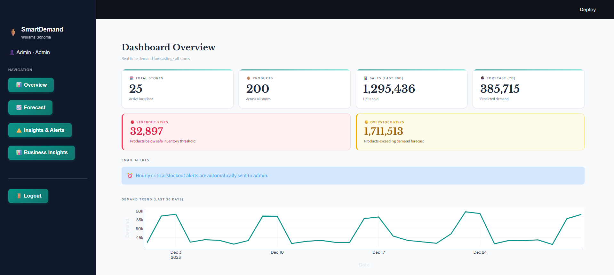
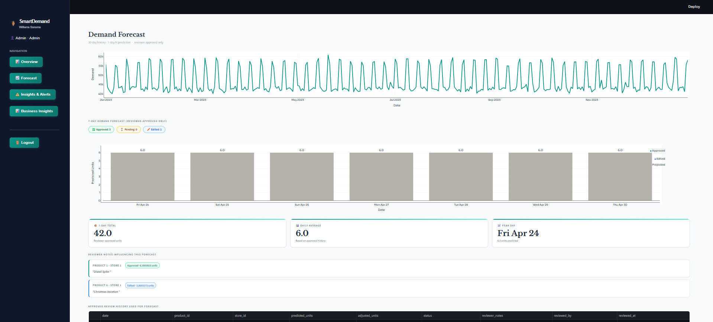
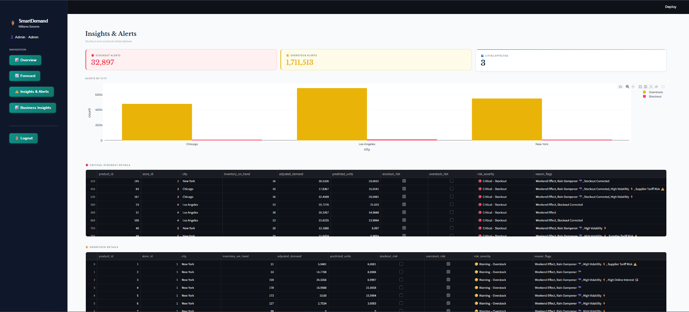
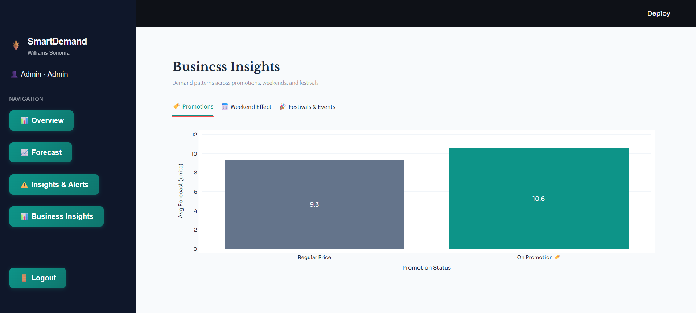
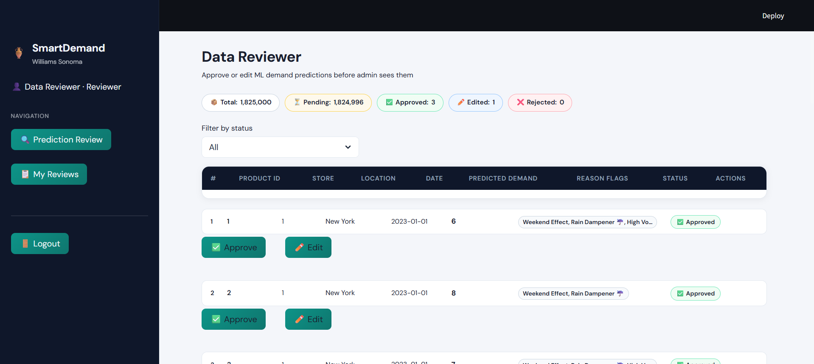

# SmartDemand — AI-Powered Demand Forecasting & Inventory Management

> Built for Williams-Sonoma retail operations | Hackathon Project

SmartDemand predicts 7-day product demand per store using XGBoost ML, explains every prediction with human-readable reason flags, detects stockout and overstock risks in real time, and includes a human-in-the-loop review workflow.

---

## Screenshots

### Dashboard Overview


### Demand Forecast (7-Day)


### Insights & Alerts


### Business Insights


### Data Reviewer


---

## Features

- **XGBoost Demand Forecasting** — 7-day demand predictions per product per store
- **Explainability Flags** — Reason flags like `Weekend Effect`, `Rain Dampener`, `Festival Impact`, `High Volatility` on every prediction
- **Risk Detection** — Critical / Warning / OK classification for stockout and overstock risks
- **Human-in-the-Loop** — Data Reviewer role to Approve / Edit / Reject ML predictions before admin sees them
- **Role-Based Auth** — Separate Admin and Reviewer dashboards with bcrypt authentication
- **Email Alerts** — Hourly automated stockout alerts via Gmail SMTP
- **Business Insights** — Promotion impact, weekend effect, and festival demand pattern analysis
- **Audit Trail** — Every reviewer action logged with notes and timestamp

---

## Tech Stack

| Layer | Technology |
|---|---|
| ML Model | XGBoost, Scikit-learn |
| Data Processing | Pandas, NumPy |
| Frontend | Streamlit, Plotly |
| Auth | bcrypt |
| Email | smtplib (Gmail SMTP) |
| Environment | python-dotenv |
| Language | Python 3.10+ |

---

## Project Structure

```
smart-demand-forecasting/
├── data/               # Data loading and preprocessing
├── features/           # Feature engineering + business rules
├── frontend/
│   ├── components/     # Sidebar, email alerts
│   └── pages/          # Admin dashboard, Data reviewer, Login
├── models/             # XGBoost train, predict, feedback
├── utils/              # Risk detection, reason flags
├── main.py             # Streamlit entry point
├── app.py              # App config
└── requirements.txt
```

---

## Setup & Run

### 1. Clone the repo
```bash
git clone https://github.com/Saachi-P006/smart-demand-forecasting.git
cd smart-demand-forecasting
```

### 2. Install dependencies
```bash
pip install -r requirements.txt
```

### 3. Configure environment
Create a `.env` file in the root directory:
```
EMAIL_SENDER=your_email@gmail.com
EMAIL_PASSWORD=your_app_password
```

### 4. Run the app
```bash
streamlit run main.py
```

App opens at `http://localhost:8501`

---

## Roles

| Role | Access |
|---|---|
| Admin | Dashboard overview, demand forecast, alerts, business insights |
| Reviewer | Approve / Edit / Reject ML predictions, view audit log |

---

## Built By

- **Saachi Patwari** — Cummins College of Engineering for Women, Pune
- Hackathon: WSI Thon
